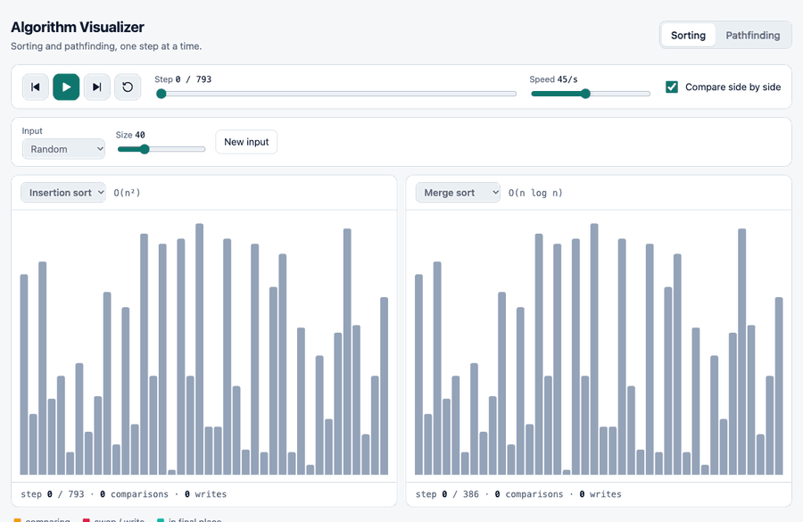
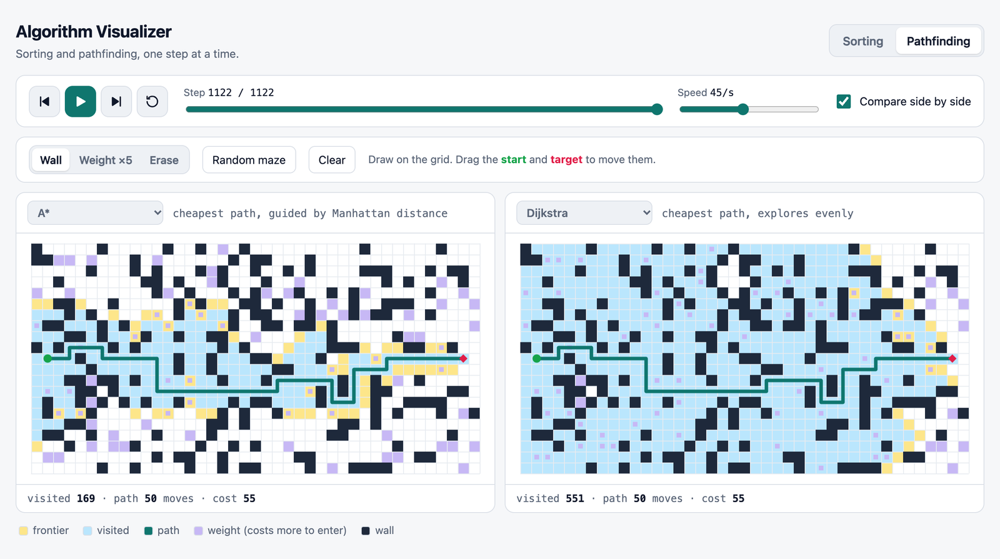
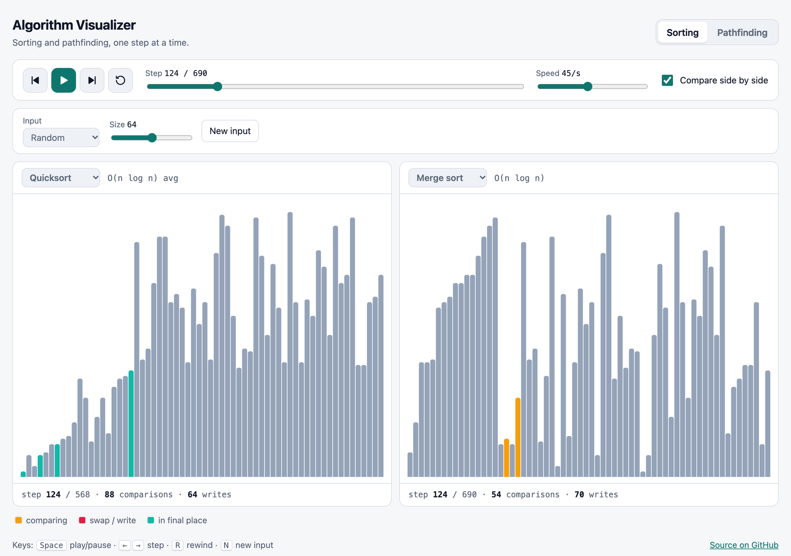

# Algorithm Visualizer

**English** · [Português (Brasil)](README.pt-BR.md)

[](https://github.com/FabianoArthur/algorithm-visualizer/actions/workflows/ci.yml)
[](LICENSE)

Step through sorting and pathfinding algorithms one operation at a time: play, pause, step back and forward, scrub, and set the speed.
You can also run **two algorithms side by side on the same input** and watch where they differ.

**Live demo:** https://fabianoarthur.github.io/algorithm-visualizer/



## What it does

| Sorting | Pathfinding |
|---|---|
| Bubble, insertion, merge, quick and heap sort | Breadth-first search, Dijkstra and A* |
| Four input shapes: random, nearly sorted, reversed, few unique values | Editable grid: draw walls, paint heavy cells (weight ×5), drag the start and the target |
| Live counters for comparisons and array writes | Live counters for visited cells and frontier, then the path length and its cost |

It also has:

- **Compare mode.** Two panels share one input and one clock. The counters make the trade-offs concrete. For example, insertion sort needs many more steps than merge sort on random data, but finishes almost at once on nearly sorted input. A* and Dijkstra always agree on the cost, but A* usually explores fewer cells. BFS finds the fewest *moves*, and on weighted grids that path can cost more.
- **Real stepping.** Step back is exact, not an undo buffer. The scrubber jumps anywhere in the run.
- **Keyboard support.** <kbd>Space</kbd> plays and pauses, <kbd>←</kbd>/<kbd>→</kbd> step, <kbd>R</kbd> rewinds, and <kbd>N</kbd> makes a new input or maze.
- **Accessibility.** Real buttons with visible focus and a screen-reader summary of each panel. The page follows your light/dark theme, and when `prefers-reduced-motion` is on, playback starts slow. Drawing on the grid needs a mouse, pen or touch; from the keyboard you can still make a random maze or clear the grid.

<picture>
  <source media="(prefers-color-scheme: dark)" srcset="docs/assets/pathfinding-dark.png">
  
</picture>

<picture>
  <source media="(prefers-color-scheme: dark)" srcset="docs/assets/sorting-dark.png">
  
</picture>

## How it works

<picture>
  <source media="(prefers-color-scheme: dark)" srcset="docs/assets/architecture-dark.svg">
  
</picture>

The main design choice: **an algorithm never touches the screen.** Each one is a pure function that takes the input and returns a
**trace**, the full list of steps it would take:

```ts
type SortStep =
  | { kind: 'compare'; i: number; j: number }
  | { kind: 'swap'; i: number; j: number }
  | { kind: 'write'; i: number; value: number }
  | { kind: 'sorted'; indices: number[] };
```

This is why the rest is simple:

- **Playback is just an index.** `Player` holds a position in `[0, trace.length]` and a speed. It has no timers and no DOM, so it's unit-tested.
- **Step back is exact.** `SortReplay` / `PathReplay` rebuild the state at step `i`. Going forward applies only the new steps. Going back replays from the start, which takes well under a millisecond at these sizes.
- **Correctness is testable.** Each test replays a trace and compares the result with an independent reference.
- **Comparison comes free.** Two traces of the same input advance on the same clock.

Pathfinding details: moving into a cell costs that cell's weight (an integer from 1 to 9, default 1). A* uses the Manhattan distance times the
minimum weight, so its heuristic never overestimates: it is admissible and consistent, and A* stays optimal. Heap ties are broken by insertion
order, so every run of the same input gives the same trace.

```
src/
├── core/          rng (seeded), heap, player, speed: no DOM
├── sorting/       algorithms → SortStep[], replay, input presets
├── pathfinding/   grid model, BFS / Dijkstra / A* → PathStep[], replay
└── ui/            canvas renderers (bars, grid), panels, app wiring
```

No framework: TypeScript, Vite and the Canvas 2D API. The production bundle is about 8 kB of JavaScript after gzip.

## Run it locally

Requires Node.js 20.19+ (22 recommended; see `.nvmrc`).

```bash
npm ci
npm run dev        # http://localhost:5173
```

| Script | What it does |
|---|---|
| `npm test` | Runs the unit tests (Vitest) |
| `npm run lint` | Runs ESLint with type-aware `typescript-eslint` (strict) |
| `npm run typecheck` | Runs `tsc --noEmit` |
| `npm run build` | Type-checks, then builds to `dist/` |
| `npm run preview` | Serves the production build |

The app needs no environment variables and no backend, so there is no `.env` file.

## Tests

**78 tests** in 9 files, covering the logic that matters:

- Each of the 5 sorting algorithms runs on 207 inputs: edge cases, duplicates, and seeded random arrays. Replaying the trace must give exactly `[...input].sort()`. The input must not be mutated, and every index must stay in bounds.
- Each of the 3 pathfinding algorithms runs on 200 random grids: it must find a valid, contiguous path whenever one exists (checked against an independent reference), and report none otherwise.
- **Optimality:** BFS must match a reference BFS on step count. Dijkstra *and* A* must both match a Bellman-Ford-style reference cost on 200 weighted grids.
- Incremental replay must equal a full replay at every index, going forwards and backwards.
- `Player`, the heap, the seeded RNG, input presets, grid rules (weights must be integers from 1 to 9, and walls can never cover the start or target) and the speed curve are covered too.

CI runs lint, typecheck, tests, the build and a [gitleaks](https://github.com/gitleaks/gitleaks) secret scan on every PR, with actions pinned by commit SHA.
Every push to `main` is deployed to GitHub Pages.

## License

[MIT](LICENSE) © 2026 Fabiano Arthur
