# Algorithm Visualizer

[English](README.md) · **Português (Brasil)**

[](https://github.com/FabianoArthur/algorithm-visualizer/actions/workflows/ci.yml)
[](LICENSE)

Acompanhe algoritmos de ordenação e de caminho mínimo uma operação por vez: tocar, pausar, voltar e avançar um passo, arrastar a linha do tempo e
ajustar a velocidade. Dá também para rodar **dois algoritmos lado a lado na mesma entrada** e ver onde eles se diferenciam.

**Demo ao vivo:** https://fabianoarthur.github.io/algorithm-visualizer/


## O que ele faz

| Ordenação | Caminho mínimo |
|---|---|
| Bubble, insertion, merge, quick e heap sort | Busca em largura (BFS), Dijkstra e A* |
| Quatro formatos de entrada: aleatória, quase ordenada, invertida, poucos valores distintos | Grade editável: desenhe paredes, pinte células pesadas (peso ×5), arraste o início e o destino |
| Contadores ao vivo de comparações e escritas no vetor | Contadores ao vivo de células visitadas e de fronteira, depois o tamanho do caminho e o custo |

Além disso:

- **Modo comparação.** Dois painéis compartilham a mesma entrada e o mesmo relógio. Os contadores deixam as diferenças concretas. Por exemplo, o insertion sort precisa de muito mais passos que o merge sort em dados aleatórios, mas termina quase na hora numa entrada quase ordenada. A* e Dijkstra sempre chegam ao mesmo custo, mas o A* costuma explorar menos células. A BFS acha o caminho com menos *movimentos*, e numa grade com pesos esse caminho pode sair mais caro.
- **Passo a passo de verdade.** Voltar um passo é exato, não é um buffer de desfazer. A linha do tempo pula para qualquer ponto da execução.
- **Atalhos de teclado.** <kbd>Espaço</kbd> toca e pausa, <kbd>←</kbd>/<kbd>→</kbd> andam um passo, <kbd>R</kbd> volta ao início e <kbd>N</kbd> gera uma nova entrada ou um novo labirinto.
- **Acessibilidade.** Botões de verdade com foco visível e um resumo de cada painel para leitores de tela. A página segue o tema claro/escuro do sistema e, com `prefers-reduced-motion` ligado, a reprodução começa devagar. Desenhar na grade exige mouse, caneta ou toque; pelo teclado ainda dá para gerar um labirinto aleatório ou limpar a grade.

<picture>
  <source media="(prefers-color-scheme: dark)" srcset="docs/assets/pathfinding-dark.png">
  
</picture>

<picture>
  <source media="(prefers-color-scheme: dark)" srcset="docs/assets/sorting-dark.png">
  
</picture>

## Como funciona

<picture>
  <source media="(prefers-color-scheme: dark)" srcset="docs/assets/architecture.pt-BR-dark.svg">
  
</picture>

A decisão central: **o algoritmo nunca mexe na tela.** Cada um é uma função pura que recebe a entrada e devolve um **rastro**, a lista
completa dos passos que ele daria:

```ts
type SortStep =
  | { kind: 'compare'; i: number; j: number }
  | { kind: 'swap'; i: number; j: number }
  | { kind: 'write'; i: number; value: number }
  | { kind: 'sorted'; indices: number[] };
```

É por isso que o resto fica simples:

- **A reprodução é só um índice.** O `Player` guarda uma posição em `[0, rastro.length]` e uma velocidade. Não tem timer nem DOM, então é testado com testes unitários.
- **Voltar um passo é exato.** `SortReplay` / `PathReplay` reconstroem o estado no passo `i`. Para frente, aplicam só os passos novos. Para trás, refazem do início, o que leva bem menos de um milissegundo nesses tamanhos.
- **A corretude é testável.** Cada teste refaz um rastro e compara o resultado com uma referência independente.
- **A comparação sai de graça.** Dois rastros da mesma entrada avançam no mesmo relógio.

Detalhes do caminho mínimo: entrar numa célula custa o peso dela (um inteiro de 1 a 9, padrão 1). O A* usa a distância de Manhattan vezes o peso
mínimo, então a heurística nunca superestima: ela é admissível e consistente, e o A* continua ótimo. Empates no heap são desfeitos pela ordem de inserção, então
cada execução da mesma entrada gera o mesmo rastro.

```
src/
├── core/          rng (com semente), heap, player, velocidade: sem DOM
├── sorting/       algoritmos → SortStep[], replay, formatos de entrada
├── pathfinding/   modelo da grade, BFS / Dijkstra / A* → PathStep[], replay
└── ui/            renderizadores em canvas (barras, grade), painéis, ligação do app
```

Sem framework: TypeScript, Vite e a API Canvas 2D. O bundle de produção tem uns 8 kB de JavaScript depois do gzip.

## Como rodar

Precisa do Node.js 20.19+ (recomendado 22; veja o `.nvmrc`).

```bash
npm ci
npm run dev        # http://localhost:5173
```

| Script | O que faz |
|---|---|
| `npm test` | Roda os testes unitários (Vitest) |
| `npm run lint` | Roda o ESLint com `typescript-eslint` ciente de tipos (strict) |
| `npm run typecheck` | Roda `tsc --noEmit` |
| `npm run build` | Checa os tipos e gera o build em `dist/` |
| `npm run preview` | Serve o build de produção |

O app não usa variáveis de ambiente nem backend, então não há arquivo `.env`.

## Testes

**78 testes** em 9 arquivos, cobrindo a lógica que importa:

- Cada um dos 5 algoritmos de ordenação roda em 207 entradas: casos de borda, repetidos e vetores aleatórios com semente. Refazer o rastro tem que dar exatamente `[...entrada].sort()`. A entrada não pode ser alterada, e todo índice precisa ficar dentro dos limites.
- Cada um dos 3 algoritmos de caminho roda em 200 grades aleatórias: tem que achar um caminho válido e contínuo sempre que existe um (conferido contra uma referência independente) e informar que não há caminho quando não existe.
- **Otimalidade:** a BFS tem que bater com uma BFS de referência no número de passos. O Dijkstra *e* o A* têm que bater com o custo de uma referência no estilo Bellman-Ford em 200 grades com pesos.
- O replay incremental tem que ser igual ao replay completo em todos os índices, para frente e para trás.
- `Player`, o heap, o RNG com semente, os formatos de entrada, as regras da grade (o peso tem que ser um inteiro de 1 a 9, e parede nunca cobre o início nem o destino) e a curva de velocidade também são testados.

A CI roda lint, checagem de tipos, testes, o build e uma varredura de segredos com [gitleaks](https://github.com/gitleaks/gitleaks) em todo PR, com as actions fixadas por SHA de commit.
Cada push na `main` é publicado no GitHub Pages.

## Licença

[MIT](LICENSE) © 2026 Fabiano Arthur
